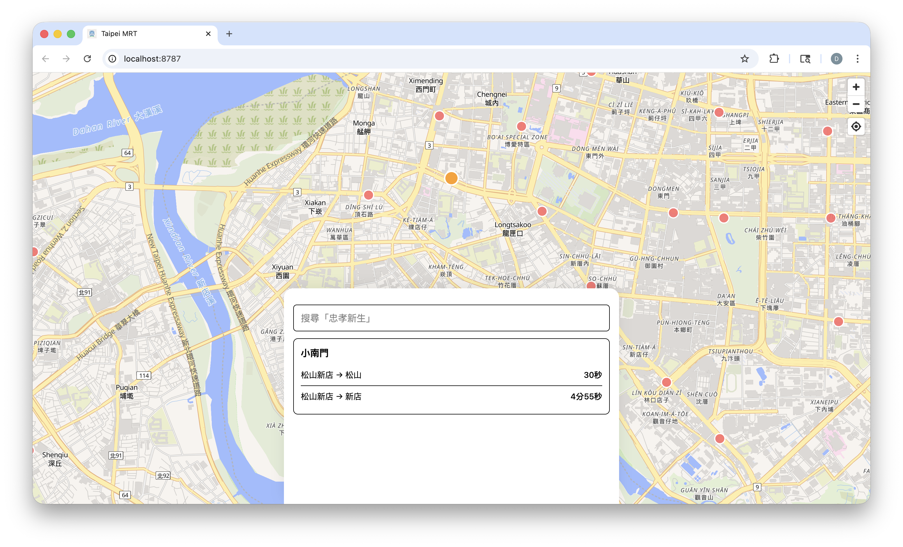

# MRT App: Because We Couldn't Call It "Definitely-Not-BusPlus"

https://mrt-app.davidyen1124.workers.dev/

Congratulations, you have stumbled upon the spiritual web reincarnation of the Bus+ Taipei MRT experience. It runs on Cloudflare Workers, React, and a steady diet of sarcasm. Please keep your hands, feet, and unmanaged state inside the ride at all times.

## What Is This Circus?
- `frontend/` – Vite + React + Tailwind. Yes, another SPA. No, we are not sorry.
- `worker/` – Cloudflare Worker that babysits static assets and tells upstream ETAs to get their act together.
- `data/` – The sacred JSON scrolls (`taipei_stations_combined.json`) we swiped from the depths of the APK.

If you're here to find monolithic PHP or jQuery, the exit is located behind you. Mind the gap.

## Ritual Summoning Instructions
1. `cd frontend && npm install` – appease the dependency gods.
2. `cd ../worker && npm install` – because workers also need their oat milk lattes.
3. `cd ../frontend && npm run build` – forge the bundle so the Worker has something to brag about.
4. `cd ../worker && npm run dev` – conjure the local Worker at `http://localhost:8787`. It proxies `/api/*`, answers questions, and occasionally judges you.

Wrangler login happens outside this README. If you skipped that, enjoy reading error logs like tea leaves.

## Feature-ish Highlights
- Single-page UI with station map, search, ETA sheet, and more Tailwind classes than CSS therapy can handle.
- Cloudflare Worker piping ETAs through the `TAIPEI_ETA_BASE` funnel defined in `worker/wrangler.toml`. Change it responsibly (translation: don't break prod).
- Static assets live in KV, because why not turn your frontend into key-value fan fiction.

## Daily Workflow (Because Chaos Needs Structure)
- Install deps in both `frontend/` and `worker/` before touching anything. Future-you will thank Past-you, maybe.
- After poking assets or JSON, run `npm run build` in `frontend/`. Otherwise the Worker serves stale memories.
- `npm run dev` in `worker/` keeps the API and SPA married. They are on speaking terms as long as you rebuild occasionally.
- Questions you can't answer become TODOs or GitHub issues. Vague comments like "fix later??" will be publicly shamed.

## API Buffet
- `GET /api/health` – heartbeat check. If this fails, the apocalypse is now.
- `GET /api/mrt/taipei/stations` – returns station metadata complete with coordinates. Reads straight from `data/taipei_stations_combined.json`, so maybe don't rename fields on a whim.
- `GET /api/mrt/taipei/eta?stationId=<id>` – upstream ETA proxy that sprinkles in `arriveAt` timestamps. Think of it as customer service for trains.
- `GET /api/mrt/taipei/car-load?stationId=<id>` – Taipei Metro car-load proxy. It ranks cars 1-6 and sends back the best boarding spots before your legs file a complaint.

Environment override? Set `TAIPEI_ETA_BASE` in Wrangler and hope you know what you're doing.
Car-load data needs Taipei Metro credentials in Worker secrets: `TAIPEI_CAR_WEIGHT_USERNAME` and `TAIPEI_CAR_WEIGHT_PASSWORD`.

## Data Drama
- Schema expects `id`, `codes`, `name_zh`, `lat`, `lng`. Break it and the UI will throw a tantrum.
- Document how you refreshed data in your PR. "Found it on the internet" is not documentation.
- APK-derived goodies stay inside this repo. We're builders, not pirates.

## Testing (Yes, We Do That)
- Frontend smoke tests hide in `frontend/tests/`. Run `npx playwright install` once, then `npx playwright test` like you mean it.
- Worker logic tweaks deserve Vitest/Miniflare coverage. Deterministic tests only—no dialing live upstreams for gossip.
- If you add flaky tests, you get to triage them forever. Enjoy.

## Deployment Shenanigans
- `wrangler.toml` already knows about `__STATIC_CONTENT` and `compatibility_date`. You’re welcome.
- Before `npm run deploy`, make sure `CLOUDFLARE_ACCOUNT_ID` and `CLOUDFLARE_API_TOKEN` are configured. Otherwise you’ll relearn the meaning of “403”.
- GitHub Actions can mirror the same commands once secrets exist. Copy-paste wisely.

## Collaboration Rules Of Engagement
- Read `AGENTS.md`. It's the treaty that keeps everyone from rage-quitting.
- Use Conventional Commits with scopes (`feat(frontend): ...`, `fix(worker): ...`). Your future git archaeologist will salute you.
- Branch from `main`, rebase often, attach screenshots/videos when the UI changes, and resist the urge to drop sneaky TODO comments without context.

## Frequently Imagined Questions
- **Can I rename the repo again?** Please consult your therapist first.
- **Why Cloudflare Workers?** Because we like edge compute and mild masochism.
- **Is the sarcasm mandatory?** Absolutely. Tests fail without it.

Thank you for riding the MRT App. Mind the closing doors, and push your commits responsibly.
