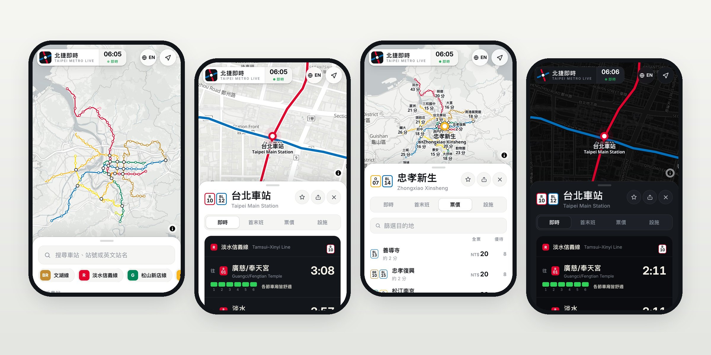
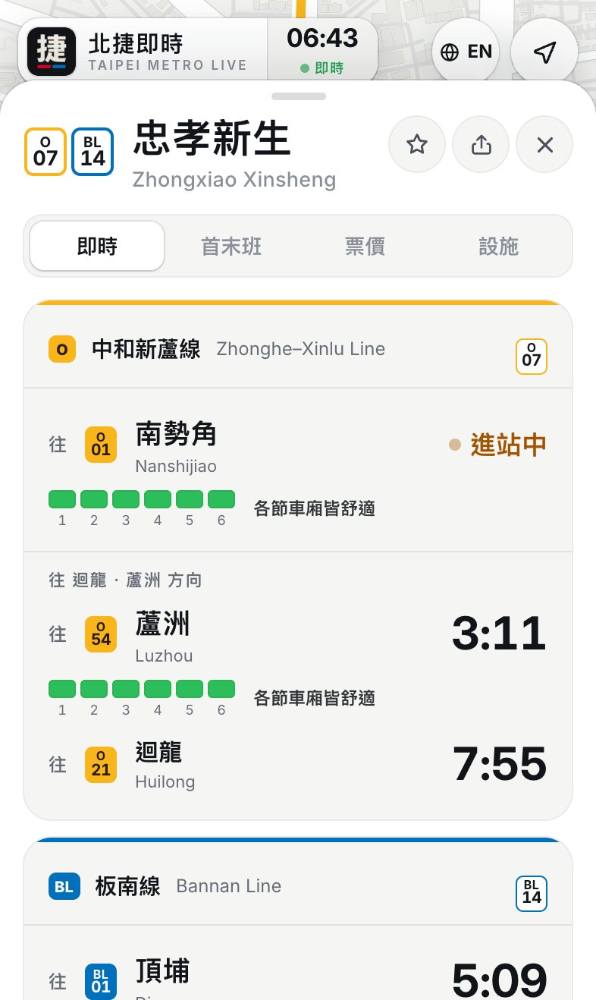
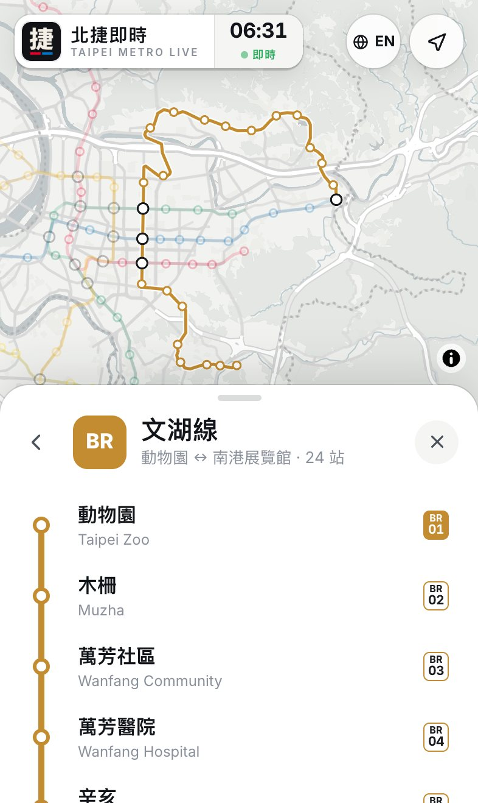
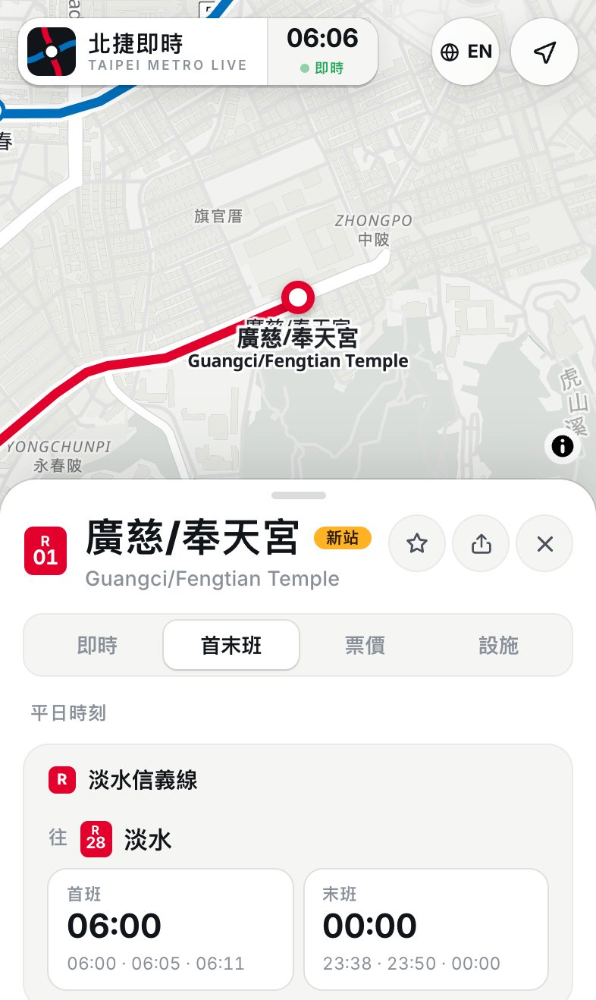
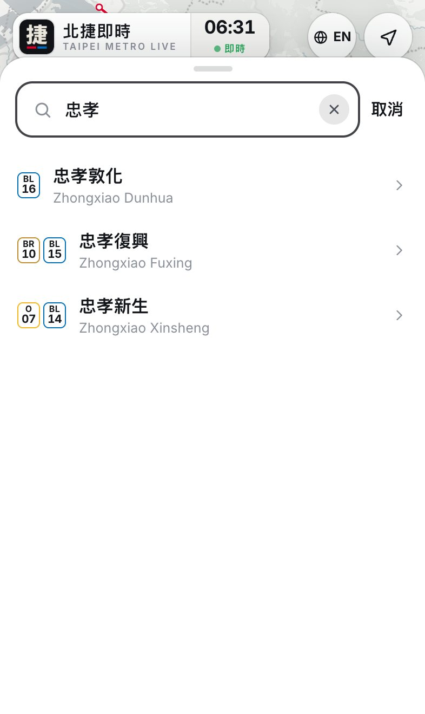
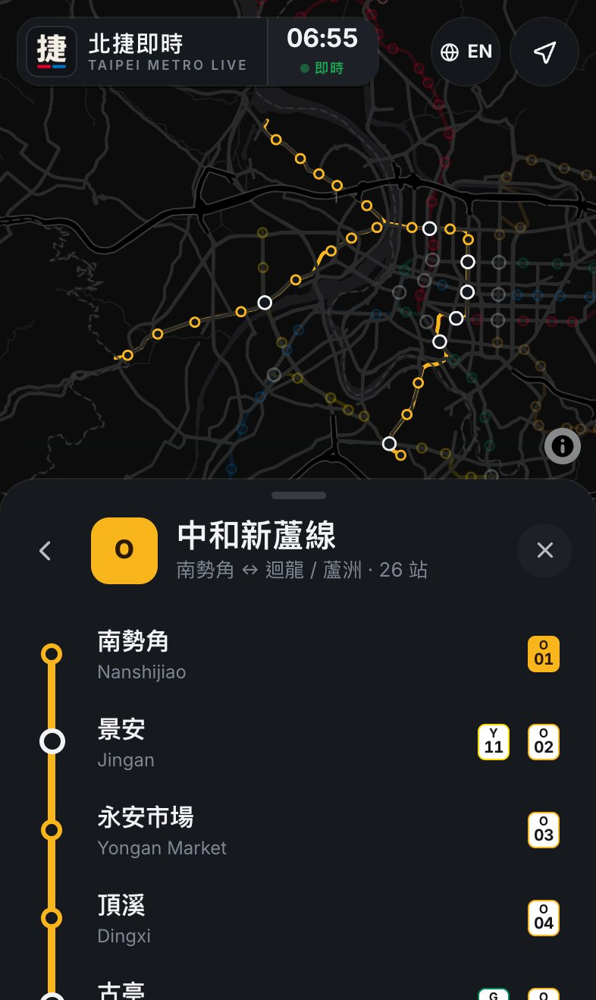
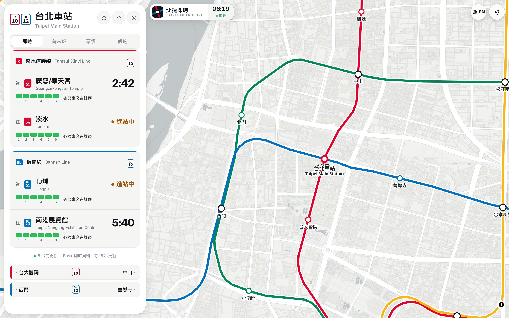
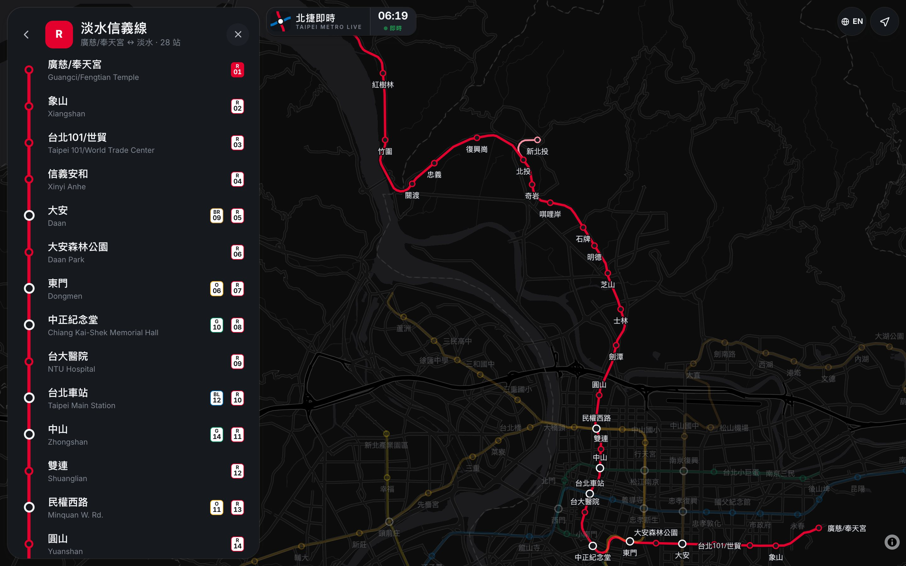

<div align="center">


# 北捷即時 · Taipei Metro Live

**台北捷運即時到站、車廂擁擠度、首末班車、票價與車站設施 — 一張地圖全部看完。**<br />
Live arrivals, car crowding, first/last trains, fares and station facilities for the Taipei Metro, on one map.

[**mrt-app.davidyen1124.workers.dev**](https://mrt-app.davidyen1124.workers.dev/) · Add it to your home screen — it installs like an app.



</div>

## What's inside

| | |
| --- | --- |
| **Platform-board arrivals** | Every line at the station gets a departure board: destination, terminus-or-short-turn badge, and a countdown that ticks between refreshes (`3:25` under ten minutes, amber `進站中` when the train is in). Trains are grouped by direction, and forks such as 大橋頭 show both branches. |
| **Car crowding** | Taipei Metro's live six-car load levels (舒適 / 普通 / 稍擠 / 擁擠) sit under the next train, with the best cars to board highlighted. |
| **Travel-time map** | Open **票價** and the map relabels every station with minutes from where you are, next to adult and concession fares for all 118 destinations. |
| **First & last trains** | Weekday first/last departures per direction, with a `末班車 23 分後` warning in the last 90 minutes of service. |
| **Station details** | Restrooms, information desks, lockers and bicycle rules, split by line at transfer stations. Platform-sign plates show the previous and next station on each line. |
| **Real track geometry** | Lines are drawn from OpenStreetMap in official colours over a quiet light/dark basemap, beneath its street names. Station names always take priority, and no street name can sit under a station dot. Dots sit on the track, and transfers sit at the exact crossing. Focusing a line fades the rest of the network. |
| **Find anything** | Search by Chinese name, station code (`bl14`) or English (`xinsheng`), browse line strips with branches, find the nearest stations with walking times, pin favourites. |
| **Built for phones** | Three-stop draggable sheet with velocity snapping, safe-area aware, installable PWA, deep links for every station, tab and line (`/station/R10/fares`, `/line/O`). Floating side panel on desktop. |
| **Two languages, two themes** | 中文 / English in one tap; light and dark follow the system. |

<table>
  <tr>
    <td></td>
    <td></td>
    <td></td>
    <td></td>
    <td></td>
  </tr>
</table>

<table>
  <tr>
    <td></td>
    <td></td>
  </tr>
</table>

## Design notes

The redesign started from a survey of 258 store screenshots across 36 transit apps: 台北捷運Go, Bus+, 軌島 Rail
Island, 台北捷運倒數, 查交通, 軌道通, KRTC, 台中捷運 and 桃園捷運, plus Citymapper, TfL Go and Tokyo Metro as the
quality bar. What carried over:

- **Official station plates.** Stacked line letters over the number, white with a line-colour border, and filled for
  termini. A filled destination badge means the train runs the full line; outlined means a short-turn, the same
  convention 台北捷運Go uses.
- **Signage, not dashboards.** The arrivals card borrows its structure from platform displays (big tabular
  numerals, amber for arriving) while following the light/dark theme. The brand plate and adjacent-station strips
  borrow from station name boards, an idea 軌島 does beautifully with its enamel signs.
- **Neutral chrome.** Line colours are the only saturated hues. Tokens live in `frontend/src/index.css`, and the dark
  theme is a full token swap rather than an inversion.
- **Brand art by Codex.** The 捷 app icon and the social card were generated with the Codex CLI `imagegen` skill
  (built-in `image_gen`, text rendered in-image and checked glyph by glyph). The sources live in
  [`frontend/art/`](frontend/art), with two runner-up icon concepts in `frontend/art/concepts/`. `npm run icons`
  derives every favicon, PWA icon and `og.png` from them.
- **Crowding in the row.** Crowding sits in the arrival row instead of behind an extra tap (from 台北捷運倒數), and the
  app says where its live data comes from.

## Where the data comes from

| Data | Source |
| --- | --- |
| Stations, names, first/last trains, facilities, fares | `https://apis.bus-plus.tw/v2/mrt/taipei/stations`, snapshotted into [`data/`](data) by `scripts/refresh-stations.mjs` |
| Live arrivals | `https://apis.bus-plus.tw/v2/mrt/taipei/eta?stationId=…`, proxied and normalised by the Worker |
| Car crowding | Taipei Metro `CarWeight` API (credentials held as Worker secrets) |
| Track geometry | OpenStreetMap route relations (© OpenStreetMap contributors, ODbL) |
| Basemap | [OpenFreeMap](https://openfreemap.org) positron / dark, © OpenMapTiles |

**What the Bus+ APK revealed.** We pulled Bus+ 3.7.0 for Android (`hearsilent.busplus`, signature verified) and
decompiled it:

- The Android app doesn't call `/v2/mrt/*` at all. It ships station tables, timetables and fare matrices as bundled
  JSON and asks the operators for live data directly.
- The public Bus+ API (not used by the Android app; most likely by the iOS client) exposes exactly three MRT routes: `stations`, `stations/{id}` and
  `{area}/eta`. None of them need auth, and together they're richer than anything the old dataset had: English names,
  line colours, first/last trains, facilities and a full travel-time/fare matrix.
- That feed still lacks **R01 廣慈/奉天宮**, which opened on 2026-08-30. We add it from
  [`data/station_overrides.json`](data/station_overrides.json), using the APK's timetable and fare tables and the
  station's OSM node. The override retires itself once the feed catches up.
- The **Sanying line (LB, opened 2026-06-30)** isn't in any feed or bundled asset yet, so it isn't shown.
- The previous dataset's coordinates were off by a median of 91 m (up to 581 m at 十四張), and it had an empty line
  group and duplicated transfer entries. The new snapshot fixes both.

A GitHub Action refreshes the snapshot every Monday and redeploys only when stations, timetables or fares actually
change.

## Architecture

```
frontend/   Vite + React 19 + Tailwind v4 + MapLibre GL — the app
  src/data/network.ts          typed wrapper over the bundled snapshot (lookup, neighbours, termini, search)
  src/components/station/      arrivals board, crowding strip, timetable, fares, facilities
  src/components/Sheet.tsx     draggable bottom sheet / desktop panel
  tests/                       Playwright smoke tests (live endpoints mocked)
worker/     Cloudflare Worker — /api/* plus static assets with SPA fallback
  src/eta.ts                   resolves line + direction for every train, merges platform groups
data/       generated snapshots (network, fares, line geometry, overrides)
scripts/    refresh-stations.mjs, refresh-geometry.mjs
```

### API

| Endpoint | Returns |
| --- | --- |
| `GET /api/health` | `{ ok, stations, generatedAt }` |
| `GET /api/mrt/taipei/network` (alias `/stations`) | Lines (colours, ordered stations, branch segments) and 119 physical stations |
| `GET /api/mrt/taipei/eta?stationId=R10` | `{ stationId, fetchedAt, arrivals: [{ line, direction, destination, status, seconds, label }] }`. Any code of a station works (`BL12` = `R10`). |
| `GET /api/mrt/taipei/fares?from=R01` | Minutes, adult fare and concession fare to every other station |
| `GET /api/mrt/taipei/car-load?stationId=BL12` | Per line and direction: six car load levels and the best cars |

## Development

```bash
cd frontend && npm ci && npm run build
cd ../worker && npm ci && npm run dev          # http://localhost:8787 — API + built app
cd ../frontend && npm run dev                  # http://localhost:5173 — hot reload, proxies /api to 8787
```

Checks:

```bash
cd worker && npm run typecheck && npm test     # Vitest: arrivals, fares, network data
cd frontend && npm run typecheck && npm run test:e2e   # Playwright (uses your installed Chrome)
```

Data and assets:

```bash
node scripts/refresh-stations.mjs              # Bus+ feed → data/taipei_network.json + taipei_fares.json
node scripts/refresh-geometry.mjs              # OSM → data/taipei_lines.geo.json
cd frontend && npm run icons                   # favicons, PWA icons and og.png from frontend/art/ (Codex imagegen)
cd frontend && npm run screenshots -- https://mrt-app.davidyen1124.workers.dev ../docs/screenshots
```

## Deployment

Every push to `main` runs `.github/workflows/deploy.yml`, which typechecks both packages, runs the Worker tests,
builds the app and runs `wrangler deploy`. It needs the `CLOUDFLARE_ACCOUNT_ID` and `CLOUDFLARE_API_TOKEN` repository
secrets. Car crowding needs the `TAIPEI_CAR_WEIGHT_USERNAME` and `TAIPEI_CAR_WEIGHT_PASSWORD` Worker secrets. Without
them the rest of the app works and the crowding strip simply doesn't appear.

## Credits

Unofficial and not affiliated with Taipei Metro, New Taipei Metro or Bus+. Arrival times are estimates, so trust the
platform announcements. Station and arrival data via Bus+, crowding via Taipei Metro, geometry © OpenStreetMap
contributors, basemap by OpenFreeMap © OpenMapTiles. Contribution etiquette lives in [`AGENTS.md`](AGENTS.md); the
licence is the (very official-ish) [MOIL](LICENSE).
